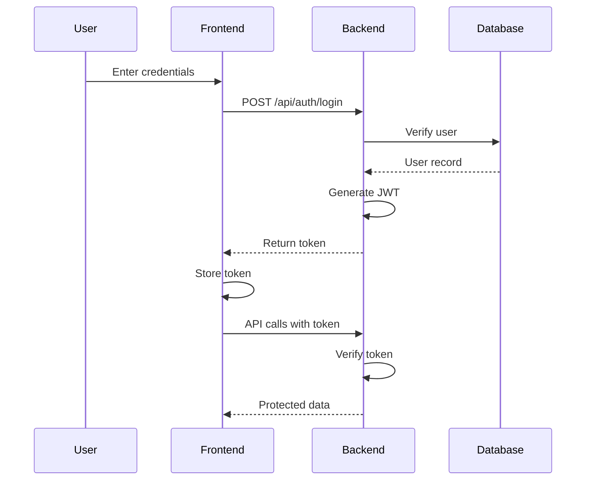
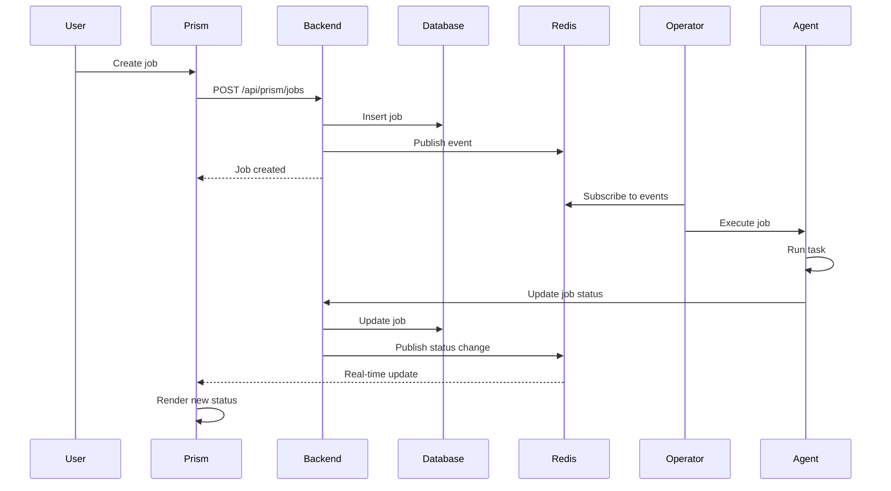

# Architecture Overview

BlackRoad Operating System is built on a multi-tier architecture that combines modern cloud infrastructure with a nostalgic Windows 95-inspired interface.

---

## System Layers

```
┌─────────────────────────────────────────────────────────────┐
│ LAYER 7: USER EXPERIENCE                                   │
│ → Browser-based OS interface (vanilla JavaScript)          │
│ → Prism Console (administrative UI)                        │
│ → Native apps (20+ built-in applications)                  │
└─────────────────────────────────────────────────────────────┘
                            ↕
┌─────────────────────────────────────────────────────────────┐
│ LAYER 6: APPLICATION LAYER                                 │
│ → FastAPI backend (REST API + WebSocket)                   │
│ → 33+ API routers for different services                   │
│ → Static file serving                                      │
└─────────────────────────────────────────────────────────────┘
                            ↕
┌─────────────────────────────────────────────────────────────┐
│ LAYER 5: ORCHESTRATION & INTELLIGENCE                      │
│ → Prism Layer (job queue, event log, metrics)             │
│ → Operator Engine (scheduled agents, workflows)           │
│ → Lucidia Layer (AI multi-model orchestration)            │
└─────────────────────────────────────────────────────────────┘
                            ↕
┌─────────────────────────────────────────────────────────────┐
│ LAYER 4: AGENT ECOSYSTEM                                   │
│ → 200+ autonomous AI agents                                │
│ → 10 agent categories                                      │
│ → Agent registry and discovery                            │
└─────────────────────────────────────────────────────────────┘
                            ↕
┌─────────────────────────────────────────────────────────────┐
│ LAYER 3: DATA & STATE                                      │
│ → PostgreSQL (relational data)                             │
│ → Redis (caching, WebSocket state)                         │
│ → RoadChain (blockchain audit log)                        │
│ → Vault (tamper-evident storage)                          │
└─────────────────────────────────────────────────────────────┘
                            ↕
┌─────────────────────────────────────────────────────────────┐
│ LAYER 2: COMPUTE & INFRASTRUCTURE                          │
│ → Railway (backend hosting, managed DB, Redis)             │
│ → DigitalOcean (future: RoadChain nodes)                  │
│ → Cloudflare Workers (edge functions)                     │
└─────────────────────────────────────────────────────────────┘
                            ↕
┌─────────────────────────────────────────────────────────────┐
│ LAYER 1: DNS & CDN                                         │
│ → Cloudflare (DNS, SSL, caching, DDoS protection)         │
│ → GoDaddy (domain registrar)                              │
└─────────────────────────────────────────────────────────────┘
```

---

## Request Flow

**User Request → Response**

1. **DNS Resolution** (Cloudflare)
    - User visits `blackroad.systems`
    - Cloudflare DNS returns Railway IP
    - SSL termination at edge

2. **CDN & Proxy** (Cloudflare)
    - Static assets cached at edge
    - Dynamic requests proxied to Railway

3. **Backend Processing** (Railway → FastAPI)
    - Request hits FastAPI backend
    - CORS middleware validates origin
    - Router matches endpoint

4. **Business Logic** (Service Layer)
    - Service layer processes request
    - Queries database (PostgreSQL)
    - Caches in Redis if needed

5. **Response** (JSON or HTML)
    - JSON for API calls
    - HTML for static pages
    - WebSocket for real-time updates

---

## Component Breakdown

### Frontend (Vanilla JavaScript)

**Location**: `backend/static/`

- **Zero dependencies**: No build process required
- **~200KB bundle**: Uncompressed total size
- **~3,500 lines**: Well-documented code
- **15 components**: Reusable UI library
- **Event-driven**: Global event bus for inter-app communication

**Key files**:

- `index.html` - Main OS entry point
- `js/os.js` - Core OS runtime
- `js/components.js` - UI component library
- `js/apps/*.js` - Individual applications

### Backend (FastAPI)

**Location**: `backend/app/`

- **Framework**: FastAPI 0.104.1
- **Server**: Uvicorn with async support
- **Database ORM**: SQLAlchemy 2.0.23 (async)
- **Validation**: Pydantic 2.5.0
- **Caching**: Redis 5.0.1

**Key files**:

- `main.py` - FastAPI app, router registration
- `config.py` - Pydantic settings
- `database.py` - SQLAlchemy async sessions
- `routers/*.py` - 33+ API endpoint routers
- `services/*.py` - Business logic layer
- `models/*.py` - Database models

### Agent Ecosystem

**Location**: `agents/`

- **Base framework**: Agent class, executor, registry
- **Categories**: 10 specialized categories
- **Count**: 200+ agents
- **Lifecycle**: initialize → execute → cleanup

**Categories**:

- DevOps, Engineering, Data Science, Security, Finance
- Creative, Business, Research, Web, AI/ML

### Prism Console

**Location**: `backend/static/prism/`

- **Purpose**: Administrative interface
- **Features**: Job queue, event log, metrics, agent management
- **Accessed at**: `/prism`
- **Tech**: Vanilla JavaScript + CSS

---

## Data Flow

### Authentication Flow



### Job Queue Flow (Prism)



---

## Technology Stack

### Backend

| Component | Version | Purpose |
|-----------|---------|---------|
| FastAPI | 0.104.1 | Web framework |
| Uvicorn | 0.24.0 | ASGI server |
| PostgreSQL | 15 | Database |
| Redis | 7 | Caching, WebSocket state |
| SQLAlchemy | 2.0.23 | ORM |
| Pydantic | 2.5.0 | Validation |

### Frontend

| Component | Version | Purpose |
|-----------|---------|---------|
| Vanilla JavaScript | ES6+ | Core runtime |
| HTML5 | - | Markup |
| CSS3 | - | Styling |

### Infrastructure

| Component | Purpose |
|-----------|---------|
| Railway | Backend hosting, DB, Redis |
| Cloudflare | DNS, SSL, CDN, DDoS |
| GitHub Pages | Documentation hosting |
| GitHub Actions | CI/CD pipelines |

---

## Security Architecture

### Authentication

- **JWT tokens**: HS256 algorithm
- **Access tokens**: 30-minute expiry
- **Refresh tokens**: 7-day expiry
- **Password hashing**: bcrypt

### CORS

- **Allowed origins**: Configured per environment
- **Credentials**: Enabled for authenticated requests
- **Methods**: All methods allowed for configured origins

### Database

- **Encryption at rest**: Railway managed
- **SSL connections**: Required in production
- **Async queries**: SQLAlchemy async sessions

### API Security

- **Rate limiting**: TODO (Phase 2.6)
- **Input validation**: Pydantic schemas
- **SQL injection prevention**: ORM parameterized queries
- **XSS prevention**: Output escaping

---

## Scalability Considerations

### Horizontal Scaling

- **Backend**: Railway auto-scaling (1-3 instances)
- **Database**: Railway managed PostgreSQL with replication
- **Cache**: Redis with persistence (AOF)

### Vertical Scaling

- **Database**: Upgrade to larger Railway plan
- **Backend**: Increase Railway service resources

### Future: Microservices

When to split (Phase 3):

- Team size > 10 developers
- Independent release cycles needed
- Different tech stacks emerging

Potential services:

- `blackroad-os-core` - Core runtime
- `blackroad-os-api` - API gateway
- `blackroad-os-prism` - Prism Console
- `blackroad-os-operator` - Worker engine

---

## Performance

### Frontend

- **Initial load**: < 2 seconds (with cache)
- **API calls**: < 100ms (median)
- **Bundle size**: ~200KB uncompressed

### Backend

- **Response time**: < 50ms (P50), < 200ms (P99)
- **Throughput**: 1000+ req/sec (single instance)
- **Database queries**: < 10ms (indexed queries)

### Caching

- **Static assets**: 1 month (Cloudflare edge)
- **API responses**: 5 minutes (Redis)
- **Database queries**: 1 minute (Redis)

---

## Monitoring & Observability

### Health Checks

- **Endpoint**: `/health`
- **Frequency**: Every 30 seconds (Railway)
- **Response**: JSON with status, timestamp

### Logging

- **Backend**: Uvicorn access logs
- **Application**: Python logging module
- **Aggregation**: Railway logs (7-day retention)

### Metrics (Future)

- **Prometheus**: Metrics collection
- **Grafana**: Dashboards
- **Sentry**: Error tracking

---

## Next Steps

- [Phase 2.5 Decisions](phase2-decisions.md) - Architectural decisions for Phase 2.5
- [Infrastructure & Deployment](infra-deployment.md) - Deployment architecture
- [API Reference](../api/overview.md) - Complete API documentation

---

**Where AI meets the open road.** 🛣️
